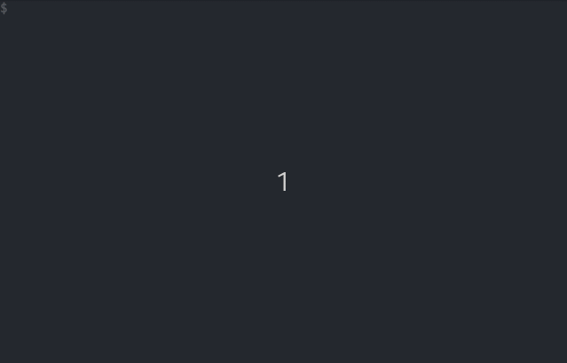

<h1 align="center">Welcome to Shease 🧀</h1>

  
  
  
  
  
  
   
  <i>A POSIX compatible shell script library and tool for number sequences with easing functions.</i>

---

## How does it look like?

  
Expand to view

  

## Usage

### Tool

### Library

## Troubleshooting

If you find any bugs/unexpected behaviour or you have a proposition for future changes open an issue describing the current behaviour and what you expected.

## Development

### Basic Workflow

### Creating a Release

## Authors

**Fin Christensen**

> [:octocat: `@fin-ger`](https://github.com/fin-ger)  
> [:elephant: `@fin_ger@weirder.earth`](https://weirder.earth/@fin_ger)  
